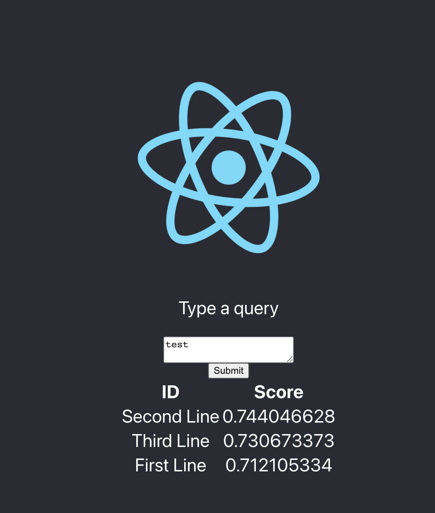

# Node.js React AI Starter App



This starter kit provides a backend and frontend for querying data from a Pinecone index using the OpenAI API. This assumes that you've used the Jupyter notebooks in the Pinecone directory to load data into your a test index.This application is built with a frontend created by [Create React App](https://create-react-app.dev/) and a backend using [Express](https://expressjs.com/). The frontend uses a proxy to redirect API requests to the backend server at `localhost:3001`.

## Development

### Frontend

Navigate to the frontend directory in your terminal and run:

```bash
npm start
```

The frontend application will run on localhost:3000, but thanks to the proxy configuration in the package.json file, all requests to unknown routes will be redirected to the backend server at localhost:3001.

### Backend

To start the backend server, navigate to the backend directory in your terminal and run:

```bash
npm start
```

The server will start on localhost:3001.


### Production
To prepare the application for production, you need to build the frontend application. This can be done by navigating to the frontend directory in your terminal and running:

```bash
npm run build
```

This will create a build directory with a production build of your application. Navigate to the backend directory and run the following command.

```bash
npm start
```

The full-stack application will now be available at localhost:3001.

