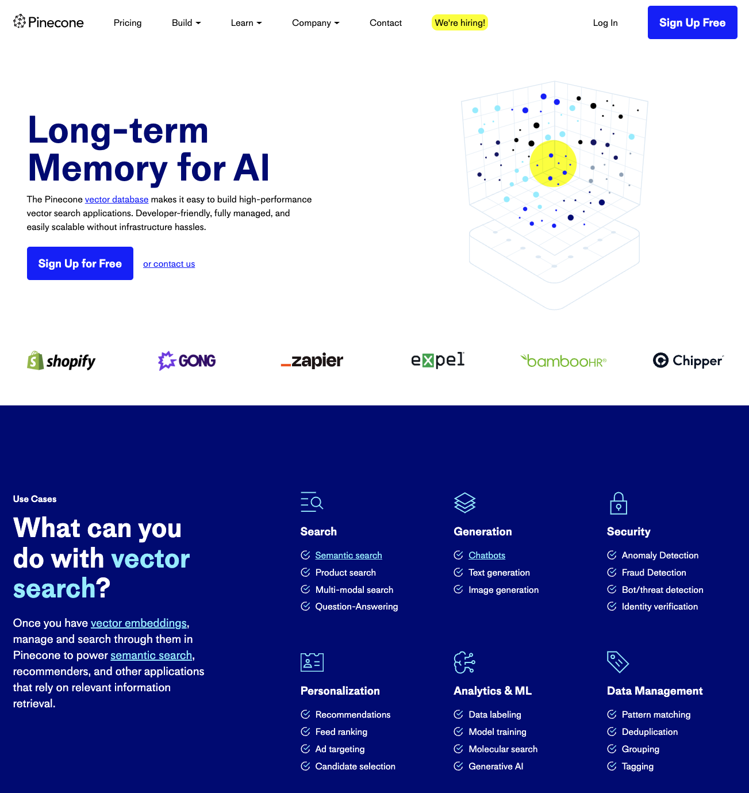
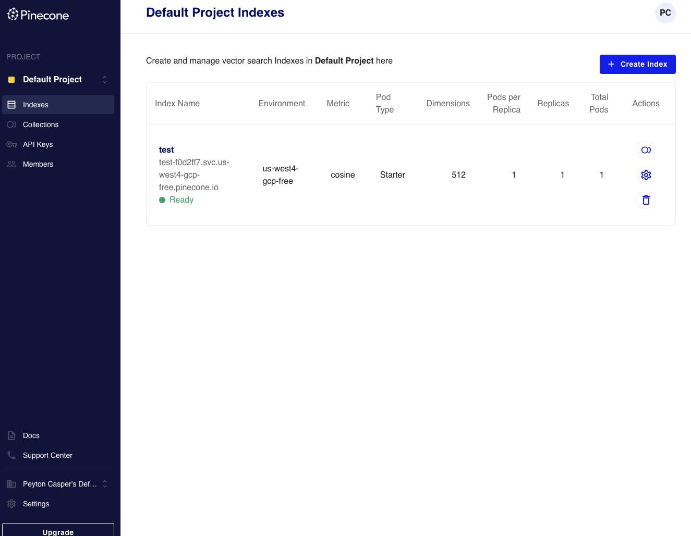
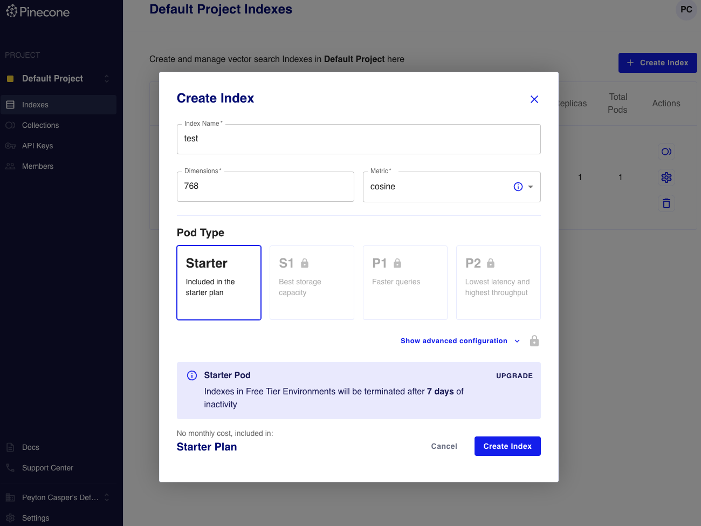
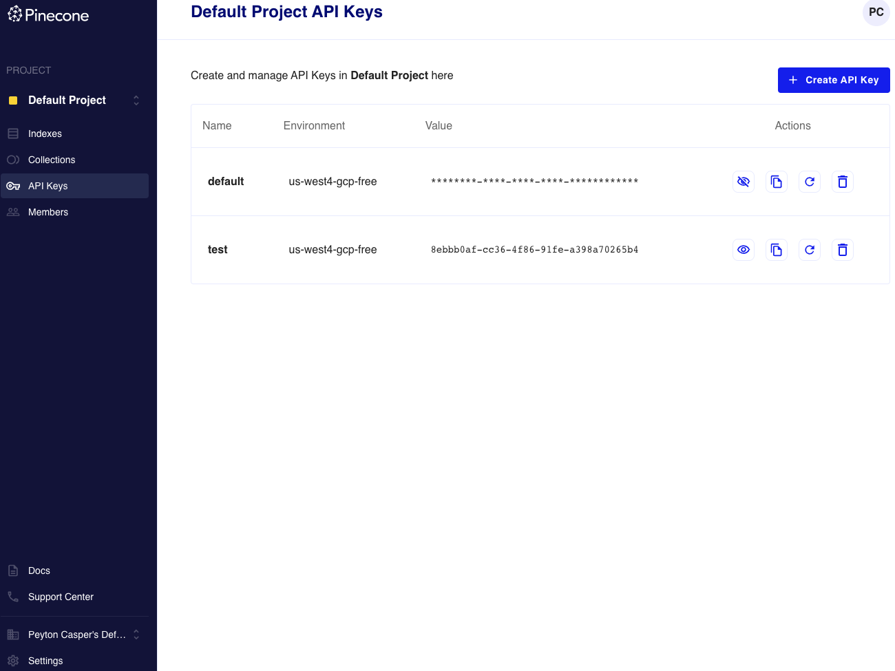

# Getting Started with Pinecone


## 1. Navigate to https://pinecone.io



## 2. Signup for a free account


## 3. Introduction



### Embeddings

Embeddings represent a piece of data that has been transformed into the vector space for a given model. This vector space is what allows Pinecone and other vector databases to run similary searches on the data to return relevant results.

An important aspect of an embedding is the number of dimensions that a given embedding will have. Different models have different dimensions and its one thing you'll need to determine.

If you're looking to leverage huggingface's sentence-transformer library, you can easily find the number of dimensions each model produces using the table below. `all-mpnet-base-v2` which is a decent, smaller OSS model produces 768 dimensions.

https://www.sbert.net/docs/pretrained_models.html

OpenAI's `text-embedding-ada-002` produces 1536 dimensions as a comparison.

https://platform.openai.com/docs/guides/embeddings/what-are-embeddings

### Collections

Think of a collection as a snapshot of an index. It represents embedding that has been loaded into Pinecone but is not queryable unless an active index has been attached. 

This is important as Pinecone will delete any indexes that haven't been touched in 7 days. However, you can quickly reattach an index to a collection at any point.

### Indexes 

An index is what makes your embeddings queryable via their API. During the configuration of an index, you'll need input the number of dimensions your data is going to have.

## 4. Creating an index



Give the index a name that is relevant to your project and input the number of dimensions that the model you want to use will output. In most cases, you're likely leverage OpenAI's embedding endpoints, so its going to be 1536 dimensions as of June 2023.

## 5. Connecting to the index

### 1. Install the pinecone-client

```
pip install pinecone-client
```

### 2. Get your API Key



Navigate to the API Keys tab, create an API Key and then copy the value from the UI. Make a note of the environment string as well. 

### 3. Set your Pinecone environment variables

```
export PINECONE_API_KEY=""
export PINECONE_ENVIRONMENT=""
```

### 4. Init a client

```
import pinecone

pinecone.init(api_key=os.getenv("PINECONE_API_KEY"), environment=os.getenv("PINECONE_ENVIRONMENT"))
```

### 5. Take a look at the two Jupyter notebooks

At this point, you should have created an index, gotten your credentials and should be ready to load some data and query it. There are two Jupyter notebooks in this folder that cover those two scenarios.


### 6. Additional Links and Resources

Sentence Transformers - https://www.sbert.net/

Open AI Embedding Cookbooks - https://github.com/openai/openai-cookbook/tree/main/examples